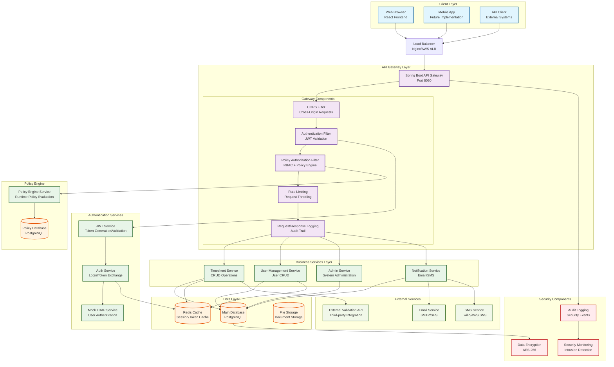

# CMIPS API Gateway Architecture Diagram

## System Overview

This document provides a comprehensive architecture diagram of the CMIPS API Gateway system, showing the complete flow from client requests through authentication, authorization, and service responses.

## Architecture Diagram



## Detailed Component Description

### 1. Client Layer
- **Web Browser (React Frontend)**: Primary user interface
- **Mobile App**: Future mobile application
- **API Client**: External system integrations

### 2. API Gateway Layer
- **Spring Boot API Gateway**: Central entry point for all requests
- **CORS Filter**: Handles cross-origin requests
- **Authentication Filter**: Validates JWT tokens
- **Policy Authorization Filter**: Enforces role-based and policy-driven access control
- **Rate Limiting**: Prevents abuse and ensures fair usage
- **Request/Response Logging**: Comprehensive audit trail

### 3. Authentication Services
- **Mock LDAP Service**: Simulates enterprise LDAP authentication
- **JWT Service**: Generates and validates JSON Web Tokens
- **Auth Service**: Orchestrates login and token exchange processes

### 4. Policy Engine
- **Policy Engine Service**: Runtime evaluation of access policies
- **Policy Database**: Stores configurable access control rules

### 5. Business Services
- **Timesheet Service**: Manages timesheet CRUD operations
- **User Management Service**: Handles user administration
- **Admin Service**: System administration functions
- **Notification Service**: Email and SMS notifications

### 6. Data Layer
- **Main Database (PostgreSQL)**: Primary data storage
- **Redis Cache**: Session and token caching
- **File Storage**: Document and attachment storage

### 7. External Services
- **External Validation API**: Third-party integrations
- **Email Service**: SMTP or cloud email services
- **SMS Service**: Text message delivery

### 8. Security Components
- **Data Encryption**: AES-256 encryption for sensitive data
- **Audit Logging**: Comprehensive security event logging
- **Security Monitoring**: Intrusion detection and alerting

## Request Flow

### 1. Authentication Flow
```
Client → Load Balancer → API Gateway → CORS Filter → Auth Filter → JWT Service → Auth Service → Mock LDAP
```

### 2. Authorized Request Flow
```
Client → Load Balancer → API Gateway → CORS Filter → Auth Filter → Policy Filter → Rate Limiting → Business Service → Database
```

### 3. Policy Evaluation Flow
```
Policy Filter → Policy Service → Policy Database → Decision (Allow/Deny)
```

## Security Features

1. **JWT-based Authentication**: Stateless token-based authentication
2. **Policy-driven Authorization**: Runtime configurable access control
3. **Role-based Access Control (RBAC)**: User role management
4. **Rate Limiting**: Request throttling and abuse prevention
5. **CORS Protection**: Cross-origin request security
6. **Audit Logging**: Comprehensive request/response logging
7. **Data Encryption**: Sensitive data protection
8. **Security Monitoring**: Real-time threat detection

## Scalability Features

1. **Load Balancer**: Horizontal scaling support
2. **Redis Caching**: Performance optimization
3. **Database Connection Pooling**: Efficient database access
4. **Stateless Design**: Easy horizontal scaling
5. **Microservice Architecture**: Independent service scaling

## Monitoring and Observability

1. **Request/Response Logging**: Full audit trail
2. **Performance Metrics**: Response time monitoring
3. **Error Tracking**: Exception and error logging
4. **Security Events**: Authentication and authorization logs
5. **Health Checks**: Service availability monitoring

This architecture provides a robust, scalable, and secure API Gateway solution for the CMIPS application with comprehensive authentication, authorization, and monitoring capabilities.


