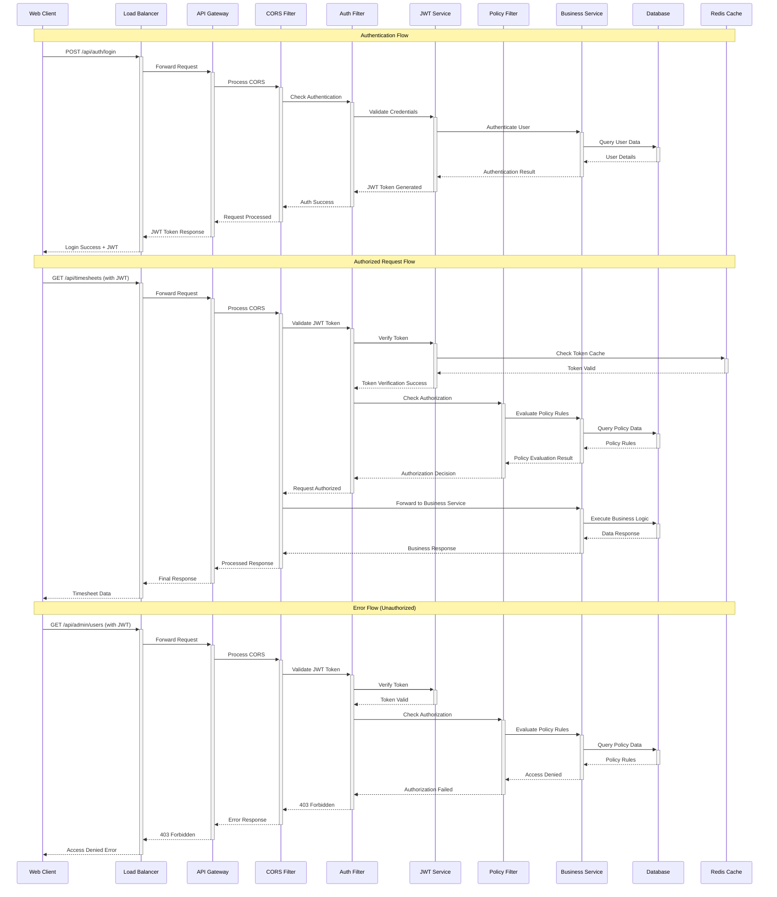
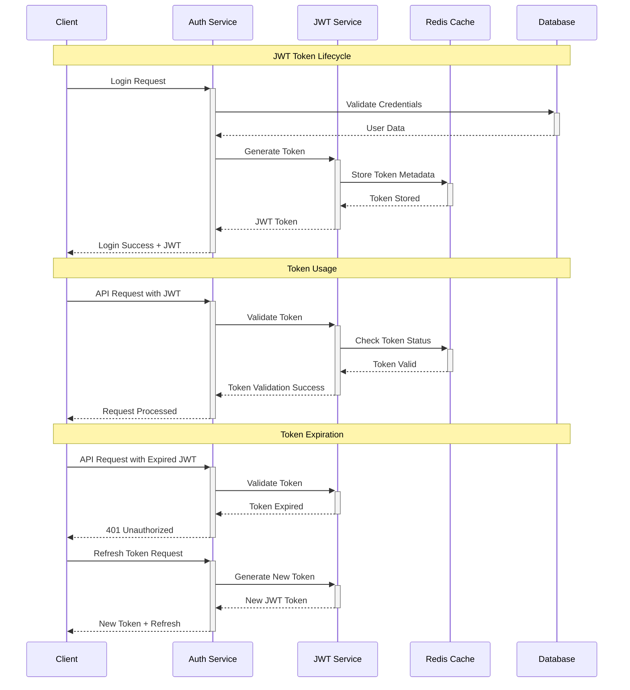
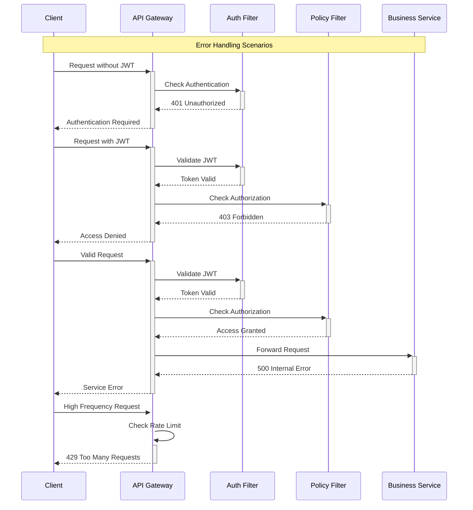

# CMIPS API Gateway Sequence Diagram

## Request Flow Sequence

This diagram shows the detailed sequence of events when a client makes a request through the API Gateway.



## Policy Evaluation Flow

```mermaid
sequenceDiagram
    participant Policy as Policy Filter
    participant Engine as Policy Engine
    participant DB as Policy Database
    participant Cache as Redis Cache
    participant Service as Business Service

    Note over Policy, Service: Policy Evaluation Process
    Policy->>+Engine: Evaluate Access Request
    Engine->>+Cache: Check Policy Cache
    alt Policy in Cache
        Cache-->>-Engine: Cached Policy Result
    else Policy not in Cache
        Engine->>+DB: Query Policy Rules
        DB-->>-Engine: Policy Rules
        Engine->>+Cache: Cache Policy Result
        Cache-->>-Engine: Policy Cached
    end
    
    Engine->>Engine: Evaluate Rules
    Note over Engine: Check Role, Resource, Action
    
    alt Access Allowed
        Engine-->>-Policy: Access Granted
        Policy->>+Service: Forward Request
        Service-->>-Policy: Business Response
        Policy-->>-Engine: Request Completed
    else Access Denied
        Engine-->>-Policy: Access Denied
        Policy-->>-Engine: 403 Forbidden Response
    end
```

## JWT Token Lifecycle



## Error Handling Flow



## Key Features Demonstrated

1. **Authentication Flow**: JWT token generation and validation
2. **Authorization Flow**: Policy-based access control
3. **Caching**: Redis-based token and policy caching
4. **Error Handling**: Comprehensive error responses
5. **Security**: Multi-layer security validation
6. **Performance**: Caching and optimization strategies
7. **Scalability**: Load balancer and stateless design

This sequence diagram shows the complete flow of requests through the API Gateway system, demonstrating how authentication, authorization, and business logic work together to provide secure and efficient API access.


